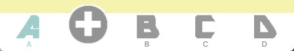
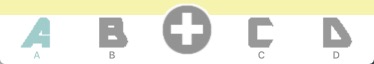
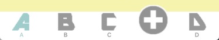
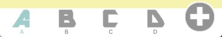

# XYXDomeTabBarController
使用Swift编写的轻量的DomeTabBar，凸起按钮可以任意设定一个位置。


可以使用cocospod管理到项目:
target 'MyApp' do
  use_frameworks!
  pod 'XYXDomeTabBarController', '~> 1.0.0'
end


框架一共三个文件，分别是：
- XYXDomeTabBarController 继承自UITabBarController，在这里初始化所有ChildViewController
- XYXDomeTabBar 用来自定义凸起按钮
- XYXShadeView 用来自定义凸起按钮的点击后操作,也可以不使用此类.

简单又灵活的使用方式:
1. 首先使用自定义的类,继承于XYXDomeTabBarController
```Swift
class YourViewController: XYXDomeTabBarController {}
```

2. 在init方法中初始化tab. 这样子设定是生成了普通的TabBar
```Swift
convenience init() {
        self.init(nibName: nil, bundle: nil)
        let controllers = [UIViewController(),UIViewController(),UIViewController()]  //TabBar对应的几个Controller
        let titleItems = ["A","B","C"]              //TabbarItem名称
        let imageItems = ["item1","item2","item3"]  //TabbarItem图片
        for idx in 0...controllers.count-1 {
            addChildViewController(controllers[idx], title: titleItems[idx], imageName: imageItems[idx], selectedImageName: selectedItems[idx])
        }
}
```
3. 使用两个方法可以设定为带有突出按钮的TabBarController
```Swift
convenience init() {
      //***
      self.domeIndex = 2  //设定凸起按钮的位置，从0开始计数
      //self.domeBar.domeButtonSize = CGSize(width: 50, height: 50) //设定凸起按钮的大小
}
```

    需注意的是:
    本Demo并不对domeIndex进行越界检查，调用时请根据自己添加的chilViewController的个数来确定domeIndex数值.
    以及,当domeIndex未设定,而设定了domeButtonSize, 则默认domeIndex=0.

domeIndex = 0时：👇


domeIndex = 1时：👇



domeIndex = 2时：👇



domeIndex = 3时：👇



domeIndex = 4时：👇


